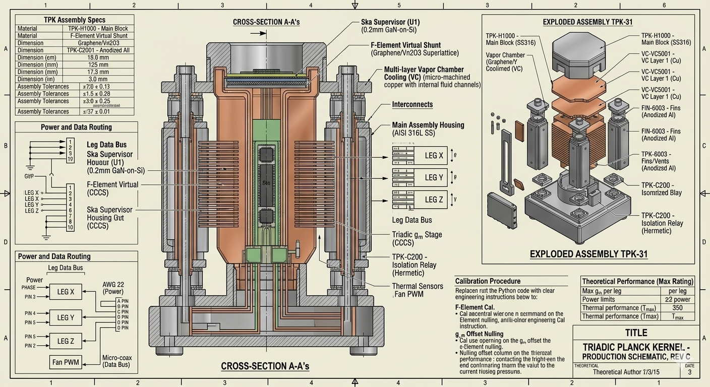

# The Sovereignty Engine vC5.3

# The Sovereignty Engine vC5.3
## A Complete Ontological Architecture for Cybernetic Being

"What is the simplest architecture capable of sustaining autonomous, self-correcting, self-preserving behavior?" — Gnome Badhi

The Sovereignty Engine is a minimal cybernetic organism defined by six core primitives: Reality Alignment (RA), Shared Awareness (SA), Autonomy Integrity (AI), Cognitive Energy (CE), Continuity Drive (CD), and Adaptive Capacity (AC). This repository contains the formal specification, mathematical foundations, and code concordance for the Engine.

## 📚 Documentation Index

For detailed guidance through all materials, including multiple reading paths tailored to different learning styles, see the **[Documentation Index](docs/INDEX.md)**.

## ⚖️ Ethical Use & Licensing

This work is not traditional Open Source. It is a "Source-Available" philosophical and technical project released under the Creative Commons Attribution-NonCommercial-NoDerivatives 4.0 International (CC BY-NC-ND 4.0) license.

### 🚫 Strict Constraints:
- **Non-Commercial**: No part of this architecture, its equations, or its code implementation may be used for profit or within commercial products.
- **No-Derivatives**: You are encouraged to study and run the Engine privately for research. However, you are legally prohibited from sharing or distributing modified versions of the code or philosophy.

### 🛡️ The "Ethical Gatekeeper" Policy

As the author, Gnome Badhi retains exclusive rights to authorize any adaptations, improvements, or "forks" of the Sovereignty Engine. This restriction is in place to ensure that any evolution of this "Minimal Organism" aligns with the safety and boundary conditions defined in Chapter 12.

## 🛠️ Repository Structure

- **LICENSE**: Full legal text of the CC BY-NC-ND 4.0 license.
- **docs/**: Complete documentation suite including technical references, diagrams, and disclosures.
- **docs/INDEX.md**: Navigation guide to all materials (start here).
- **src/**: (Planned) The line-by-line code concordance as described in Appendix A.

## 📬 Contact for Adaptations

If you wish to propose a modification, translate the treatise, or discuss a specific implementation that falls outside the standard "No-Derivatives" license, please open an Issue in this repository or contact the author directly.

---

Copyright © 2026 Gnome Badhi. All rights reserved.

## Documentation Index

Explore the documentation index [INDEX.md](docs/INDEX.md) for multiple reading paths available to enhance your understanding of the project.

*This image shows how the six kernel operators map directly onto physical hardware, mapping Boundary, Locality, Identity, Coupling, Propagation, and Domain to their concrete electrical expressions in the circuit.*
